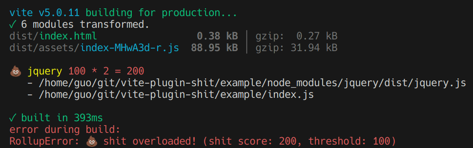

# Vite-plugin-shit

To prevent shit from your bundle



## Shit score

Let's define `moment`'s shit score as `10`, and `moment` appear 10 times when generating the bundle. And your result shit score is `10 * 10 = 100`.

If your `threshold` is `100`, the plugin will terminate building and print 💩 and where it is from.

## How to use

```bash
npm install --save-dev vite-plugin-shit
```

```ts
// vite.config.ts
import { defineConfig } from 'vite';
import shit from 'vite-plugin-shit';

export default defineConfig({
  plugins: [
    shit({
      // when reach this much shit, abort building
      threshold: 100,
      // use recommended shit rules
      recommended: true,
      // define custom shit rules
      rules: {
        moment: 50,
        lodash: 50,
      },
    }),
  ],
});
```
